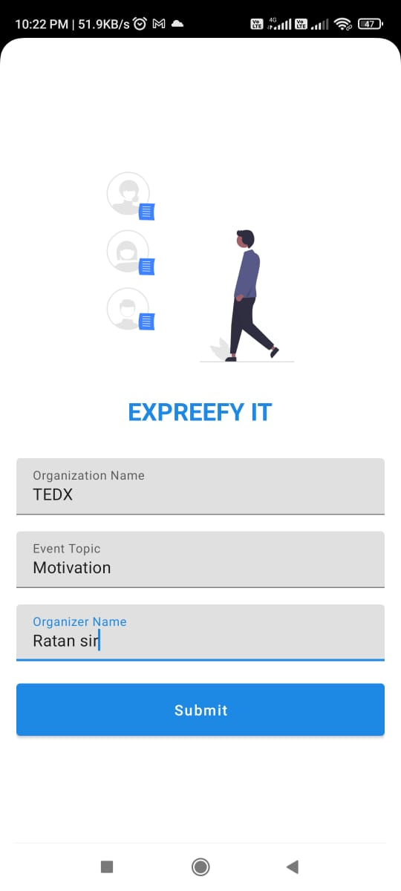
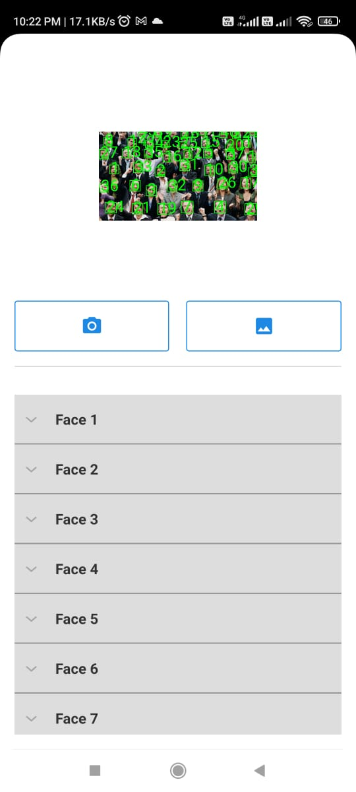

### :pushpin: Overview 
In Auditorium and Online meets like Microsoft Teams, After ending the session students gives feedback manually using different online forms. This forms takes s
students identities like their Email id, Name and other Informations. For this reason students always gives positive feedback. To avoid this I built an Android Application that recognizes users facial emotions using Tensorflow lite Library. This gives us recognition of an emotions as Happy, Sad, Neutral, Surprise, Angry, Fear, Disgust.
Out of these all emotion recognitions, I selected Happy, Neutral & Surprise as a positive response and Sad, Angry, Fear & Disgust for the negative response.

## :pushpin: Installation/Environment Setup

 ### Method 1:  Clone App 
  
  * Make a new folder and open the terminal there.
  * Write the following command and press enter.
  
  ```bash
  $ git clone https://github.com/yashrbankar/Microsoft-Engage22.git
```
* Open EmotionRecognition-master Folder in Android Studio.

### Method 2 : Using Zip file 
<a href="https://drive.google.com/drive/folders/1LIFcskxFhfe2Knc6tHj6EG_mi69Z7aht?usp=sharing" target="_blank">~~~Download Zip file~~~</a>
* Open EmotionRecognition-master Folder in Android Studio.

### Possible error during setup
#### Type of error 
 ```bash
  Task 'wrapper' not found in project ':app'.
```
#### Solution

* Error is due to the gradle **( ~~App is not recognized~~ )**
* So again open **EmotionRecognition-master** Folder in Android Studio.

## 🔗 Links for project:

* video link

<a href="https://youtu.be/OZNkSERFPIM" target="_blank">~~~**Watch Demo Video**~~~</a>


* Download Android App

<a href="https://drive.google.com/drive/folders/1LIFcskxFhfe2Knc6tHj6EG_mi69Z7aht?usp=sharing" target="_blank">~~~**Download App**~~~</a>


## 🌐 Flow Chart 

<a href="https://github.com/yashrbankar" target="_blank" rel="noreferrer noopener" >

 </img>
 </a>
 
 
 
 #Feature
 
| Parameter | Type     | Description                |
| :-------- | :------- | :------------------------- |
| `TensorFlow` | `Lite` | **Required**. For Face Recognition |
| `FireBase` | `ml api` | **Required**. for Emotion dectection (Deep learning)|


##  :pushpin: Technologies used:
<p align="left"> <a href="https://developer.android.com" target="_blank" rel="noreferrer">  </a> <a href="https://www.figma.com/" target="_blank" rel="noreferrer">  </a> <a href="https://firebase.google.com/" target="_blank" rel="noreferrer">  </a> <a href="https://git-scm.com/" target="_blank" rel="noreferrer">  </a> <a href="https://www.java.com" target="_blank" rel="noreferrer">  </a> <a href="https://www.tensorflow.org" target="_blank" rel="noreferrer">  </a> </p>

### Application Interface
Opening Page |  Main Page
------------ | ---------------------
 
 </img> |</img>

 ## :pushpin: Agile methology and workflow:
Agile methology was followed by implementation of sprint of 4 days in a week , continuous integration and developmet.
Work was proceeded in different branches using git version control and successfully developed patches were merged to ruling branch . Customer view points and Teams as an inspiration was taken in mind to develop this project. Bugs were solved according to priority scale
Priority scale : P5 (maximum) to P1 (Least)

| Week | Task |  Remarks |
|------|:----:|---------|
| 1    | **Design phase** P4: basic app built by exploring technologies  , P3: Figma|   Successfull setup implementation           |
| 2    | P4: Face Recognition , P3: Finding Faces, P2: Pie chart, P5: Camera (Bug)     |    All bugs resolved             |
| 3    | P4: Take img from gallery , P5: Firebase ml deep learning  , P3:Expression detection, P5: indivible , P4: Final Pie Result    |     Problem statement tasking completed|


## 🚩 Future Scopes:-
Feature | Explanation
------------ | -------------
Real time Detection using Cam | Using Camera of the Auditorium I will have to capture videos and to provide you the accurate feedback     
Send Code integration | A microsoft teams inspired feature of feedback for developers to work in collabrative environment and code together.

Thank you ! Microsoft Team for such a wonderful mentorship program ❤️
You can also check [My weekly record during this program]("https://github.com/yashrbankar")


## 🤝 Connect with me 


<div align="center">
 <a href="ttps://www.linkedin.com/in/yash-bankar-7962a51ba/" target="_blank">

</a>

<a href="https://github.com/yashrbankar" target="_blank">

</a>

</div>
 
 
